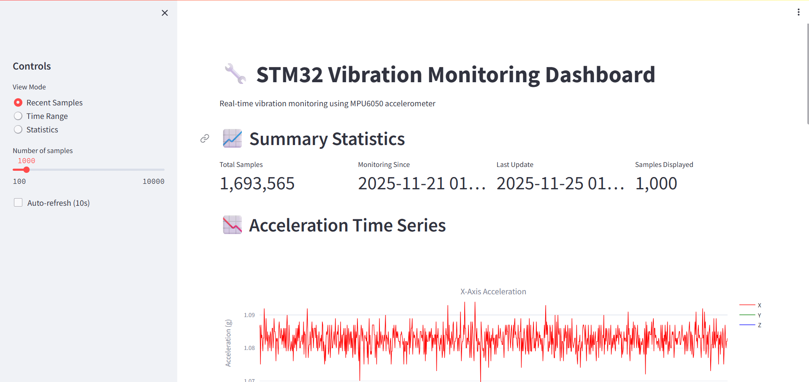
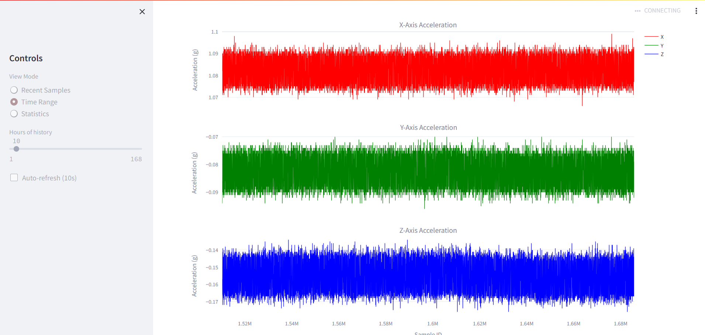
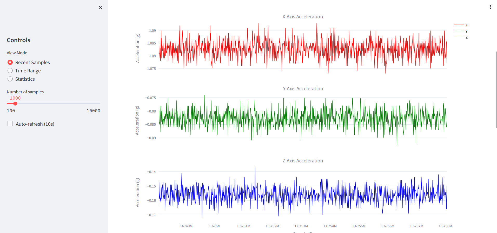
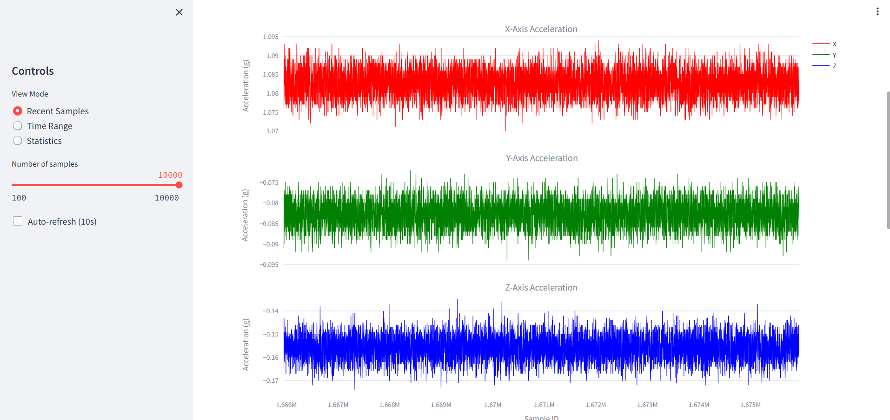
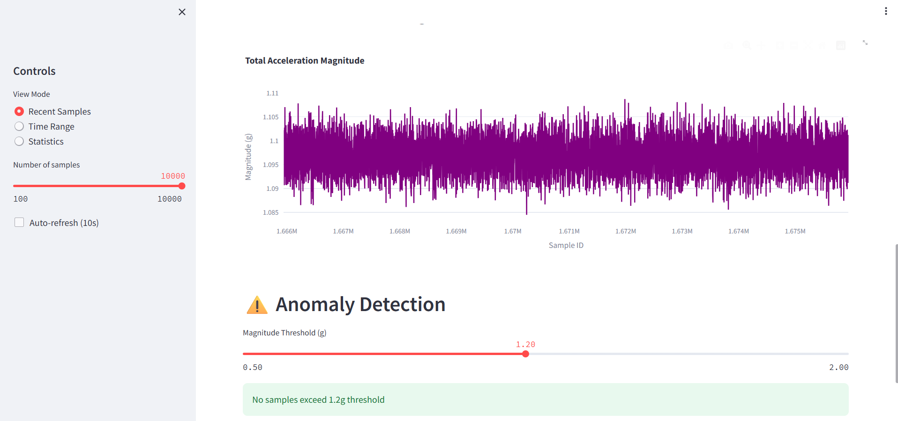
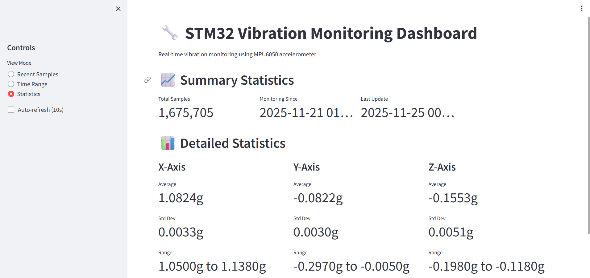

# STM32 Motion Detection System

Real-time vibration monitoring system demonstrating full-stack embedded systems development: STM32 firmware → serial communication → containerized database → data visualization.

## Hardware
- STM32L476RG Nucleo Development board
- MPU6050 6-axis accelerometer/gyroscope (I2C interface)
- USB serial communication
- Dell optiplex tower

## Software stack
- Firmware: Bare-metal C on STM32, reading MPU6050 at 10Hz, converting raw accelerometer data to G-forces
- Data Ingestion: Python script using pyserial for continuous data collection with batch PostgreSQL inserts
- Database: PostgreSQL running in Kubernetes cluster with persistent storage
- Deployment: Linux systemd service for 24/7 data collection
- Visualization: Streamlit dashboard for real-time and historical data analysis

## Features
- Real-time 3-axis acceleration monitoring (x,y,z g-force)
- Configurable motion detection with LED feedback
- Serial data streaming at 115200 baud
- New data being streamed over serial into a python script. This script then collects batches of data and sends it to a postgreSQL database.
- Next feature is to build streamlit web dashboard to manipulate and show results of collected data over time.

## Technical Details
Embedded Firmware (C):

- I2C protocol implementation for MPU6050 sensor communication
- Raw accelerometer data processing and G-force conversion
- UART serial output with formatted data stream
- 100ms sample rate with change detection

Data Pipeline (Python):

- Serial port monitoring with automatic reconnection
- Regex-based data parsing from sensor output
- Batched PostgreSQL insertions with connection pooling
- Comprehensive logging and error handling

Infrastructure:

- Multi-node Kubernetes cluster for database orchestration
- Persistent volume claims for data durability
- ClusterIP service for internal database access
- Systemd service management for reliable operation

## Hardware setup
STM32 Nucleo (STM32L476RG)
├── MPU6050 connected via I2C
│   ├── SDA → D14 (PB9)
│   ├── SCL → D15 (PB8)
│   ├── VCC → 3.3V
│   └── GND → GND
└── USB Serial → Host Computer (Dell OptiPlex)
    └── Python Ingestion Script
        └── PostgreSQL (Kubernetes Cluster)
            └── Streamlit Dashboard (Data Visualization)

## Dashboard

-The dashboard offers real-time visualization of the data within the database

### Features
- **Recent Samples**: Displays the most recent sensor readings with configurable sample count
- **Time Range Analysis**: Query historical data by date/time range
- **Live Statistics**: Shows total samples collected and collection status

-Time range from 0 hours to 168 hours/1 week.

-These next 2 screenshots show how you can move the slider to change from 1000 to 10,000 of the lastest samples.

-Data flowed none-stop to 1 million samples!

-Magnitude reading

-The Statistics feature shows the average min,max of the data plus standard deviation

